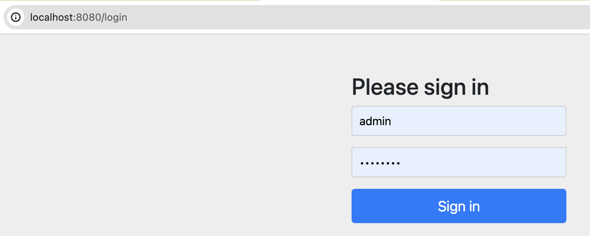

# spring-boot-security-basic

This project integrates **Spring Security** with **Spring Boot Application**.

## Tools and Technologies Used

-   Spring Boot Starter 3.2.3
-   Spring Boot Starter Web 3.2.3
-   Spring Boot Starter Security 3.2.3
-   Java SE 8
-   Maven 3.9
-   Eclipse Spring Tool Suite4 (STS)
-   Tomcat 9.x

## About the Application
- `Spring Boot Security` handles basic security configuration internally.
- It provides default credentials from the underlying security framework.


## Project Structure: Spring Boot + Spring Security


## DEMO
### 1. Spring Boot Security generated security password


### 2. Login with the default user


### 3. Successfully logged in


### 4. Specify username and password in `application.properties` file
```
spring.security.user.name=admin
spring.security.user.password=admin123
```

### 5. Login with the specified user


### 6. Successfully logged in


### 7. Configure an AuthenticationManager and have the credentials in-memory
```
package com.demo.config;

import org.springframework.context.annotation.Bean;
import org.springframework.context.annotation.Configuration;
import org.springframework.security.config.annotation.web.builders.HttpSecurity;
import org.springframework.security.config.annotation.web.configuration.EnableWebSecurity;
import org.springframework.security.core.userdetails.User;
import org.springframework.security.core.userdetails.UserDetails;
import org.springframework.security.crypto.password.NoOpPasswordEncoder;
import org.springframework.security.crypto.password.PasswordEncoder;
import org.springframework.security.provisioning.InMemoryUserDetailsManager;
import org.springframework.security.web.SecurityFilterChain;

@Configuration
@EnableWebSecurity
public class SecurityConfiguration {

	@Bean
	public InMemoryUserDetailsManager userDetailsService(PasswordEncoder passwordEncoder) {
		UserDetails user = User.withUsername("user").password(passwordEncoder.encode("password")).roles("USER").build();
		UserDetails admin = User.withUsername("admin").password(passwordEncoder.encode("admin")).roles("USER", "ADMIN")
				.build();
		return new InMemoryUserDetailsManager(user, admin);
	}

	@Bean
	public SecurityFilterChain filterChain(HttpSecurity http) throws Exception {
		http.authorizeRequests().anyRequest().authenticated().and().httpBasic();
		return http.build();
	}

	@Bean
	public PasswordEncoder getPasswordEncoder() {
		return NoOpPasswordEncoder.getInstance();
	}
}
```

### 8. Login with in-memory user


### 9. Successfully logged in


